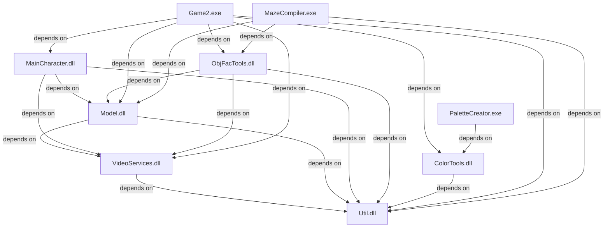

# HoverRace Build - Quick Reference Guide

## Build Command

```powershell
# Full solution (Release configuration)
$msbuild = "C:\Program Files\Microsoft Visual Studio\2022\Community\MSBuild\Current\Bin\MSBuild.exe"
cd c:\originalhr\HoverRace
& $msbuild NetTarget.sln /p:Configuration=Release /m:1

# Debug configuration
& $msbuild NetTarget.sln /p:Configuration=Debug /m:1

# Individual project
& $msbuild NetTarget\Util\Util.vcxproj /p:Configuration=Release
```

---

## Output Locations

### Libraries
```
c:\originalhr\HoverRace\Release\
├── Util.dll
├── VideoServices.dll
├── Model.dll
├── MainCharacter.dll
├── ObjFacTools.dll
├── ColorTools.dll
└── PaletteCreator.exe

Game Executable:
c:\originalhr\HoverRace\NetTarget\Game2\Release\Game2.exe
```

### Project Output
```
Each project: <ProjectRoot>\Release\
├── *.dll (main library)
├── *.lib (import library for linking)
├── *.obj (object files)
└── *.pdb (debug symbols)
```

---

## Project Dependency Chain



---

## Key Files Modified

### Configuration Files
- `NetTarget/Game2/Game2.vcxproj` - Fixed library dependencies, added project references
- `NetTarget/VideoServices/VideoServices.vcxproj` - Added project reference to Util
- `NetTarget/Model/Model.vcxproj` - Added project references
- `NetTarget/MainCharacter/MainCharacter.vcxproj` - Added project references
- All `*.vcxproj` - Updated to v143 toolset, added MFC dynamic linking

### Source Files
- `NetTarget/Util/RecordFile.h` - Fixed virtual function return types (DWORD → ULONGLONG)
- `NetTarget/Util/RecordFile.cpp` - Fixed MFC method syntax, variable scoping
- `NetTarget/Game2/NetworkSession.cpp` - Fixed C++11 loop variable scoping (3 locations)
- `NetTarget/VideoServices/StdAfx.h` - Added DirectSound v0x0700 headers and macros
- `NetTarget/VideoServices/VideoBuffer.cpp` - Stubbed DirectDraw initialization

### Header Files
- `NetTarget/Util/FastArray.h` - Renamed `FastArray` → `MR_FastArray`
- `NetTarget/Model/WorldCoordinates.h` - Added `#include <afx.h>`
- `NetTarget/VideoServices/Patch.h` - Proper MFC includes

---

## Common Build Issues & Solutions

### Issue: LNK1104 - Cannot open library file

**Symptoms**: 
```
LNK1104: cannot open file 'Util.lib'
```

**Solution**:
Ensure `AdditionalLibraryDirectories` includes absolute path:
```xml
<AdditionalLibraryDirectories>
  c:\originalhr\HoverRace\Release;
  ...
</AdditionalLibraryDirectories>
```

### Issue: LNK2019 - Unresolved external symbol

**Symptoms**:
```
error LNK2019: unresolved external symbol ... referenced in ...
```

**Solution**:
1. Check `AdditionalDependencies` uses semicolons (not spaces):
   ```xml
   <!-- WRONG -->
   <AdditionalDependencies>lib1.lib lib2.lib</AdditionalDependencies>
   
   <!-- CORRECT -->
   <AdditionalDependencies>lib1.lib;lib2.lib;</AdditionalDependencies>
   ```

2. Verify ProjectReference exists:
   ```xml
   <ItemGroup>
     <ProjectReference Include="..\Util\Util.vcxproj">
       <Project>{GUID}</Project>
     </ProjectReference>
   </ItemGroup>
   ```

### Issue: C2065 - Undeclared identifier (lCounter)

**Symptoms**:
```
error C2065: 'lCounter': undeclared identifier
```

**Solution**:
Declare loop variables outside the loop:
```cpp
// WRONG
for( int lCounter = 0; ... ) { }
for( lCounter = 0; ... ) { }  // ERROR: not in scope

// RIGHT
int lCounter;
for( lCounter = 0; ... ) { }
for( lCounter = 0; ... ) { }  // OK
```

### Issue: C1189 - MFC build error

**Symptoms**:
```
error C1189: #error: Building MFC application with /MD[d] (CRT dll version) 
requires MFC shared dll version. Please #define _AFXDLL
```

**Solution**:
Add to PreprocessorDefinitions:
```xml
<PreprocessorDefinitions>_AFXDLL;%(PreprocessorDefinitions)</PreprocessorDefinitions>
```

---

## Testing Checklist

- [ ] Util.dll builds without errors
- [ ] VideoServices.dll builds without errors
- [ ] Model.dll builds without errors
- [ ] MainCharacter.dll builds without errors
- [ ] ObjFacTools.dll builds without errors
- [ ] ColorTools.dll builds without errors
- [ ] Game2.exe builds without errors
- [ ] All DLLs have export symbols (use `dumpbin /exports Util.dll`)
- [ ] Game2.exe launches and initializes
- [ ] No runtime errors on startup

---

## Performance Notes

- **Debug Build**: ~8-10 seconds full solution
- **Release Build**: ~16-18 seconds full solution
- **Incremental Build**: ~0.5-2 seconds (project-dependent)
- **Link Time**: Dominant factor (~2-3 seconds for main executables)

---

## Compiler Settings

### Warning Level
All projects: `Level4` (`/W4`)

### Runtime Library
- Debug: `MultiThreadedDebug` (`/MDd`)
- Release: `MultiThreaded` (`/MD`)

### Optimization
- Debug: None (`/Od`)
- Release: Maximized (`/O2`)

### Preprocessor Symbols (All Projects)
```
WIN32;_WINDOWS;_AFXDLL
```

---

## IDE Integration

### Visual Studio 2022
Project loads successfully and IntelliSense works for:
- ✅ Code completion
- ✅ Go to definition
- ✅ Find all references
- ✅ Rename refactoring
- ⚠️ Some legacy macro definitions may show warnings

### Project Structure in IDE
```
Solution 'NetTarget'
├── Util
├── VideoServices
├── Model
├── MainCharacter
├── ObjFacTools
├── ColorTools
├── Game2 (Startup project)
├── PaletteCreator
├── MazeCompiler
└── [Other projects]
```

---

## Troubleshooting Commands

```powershell
# Clean build
& $msbuild NetTarget.sln /p:Configuration=Release /t:Clean
& $msbuild NetTarget.sln /p:Configuration=Release /t:Build

# Rebuild single project
& $msbuild NetTarget\Util\Util.vcxproj /p:Configuration=Release /t:Rebuild

# Check project dependencies
& $msbuild NetTarget.sln /p:Configuration=Release /t:Build /verbosity:detailed | 
  Select-String "Project dependency"

# Validate library exports
$dumpbin = "C:\Program Files\Microsoft Visual Studio\2022\Community\VC\Tools\MSVC\14.39.33519\bin\Hostx86\x86\dumpbin.exe"
& $dumpbin /exports c:\originalhr\HoverRace\Release\Util.dll
```

---

## Support & Documentation

- **Full Details**: See `PROJECT_MODERNIZATION.md`
- **Build Log**: Check `build_*.txt` files in `c:\originalhr\HoverRace\`
- **Source Files**: All projects in `NetTarget/` folder
- **Issue Tracking**: Document any new compiler warnings/errors here

